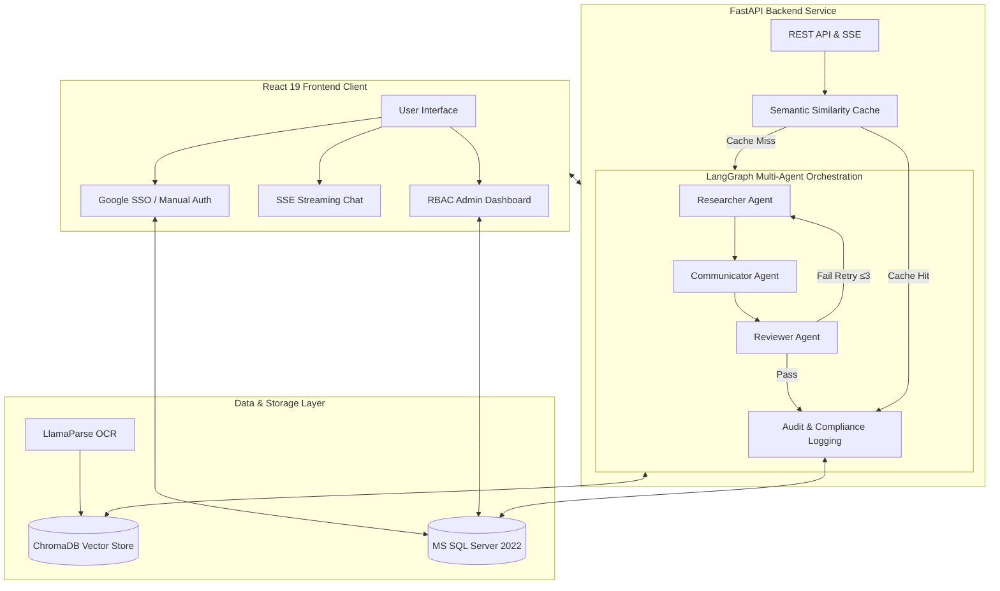

# Lumina Enterprise | Agentic RAG Platform

> **Enterprise-Grade AI Architecture for Secure Policy & Knowledge Retrieval**  
> Powered by OpenRouter · LangGraph · FastAPI · React 19 · MS SQL Server

---

## 📌 Executive Summary

**Lumina Enterprise** is a production-ready, highly secure Agentic Retrieval-Augmented Generation (RAG) platform. Designed for modern corporate infrastructure, it enables organizations to query complex internal documents through an intelligent conversational interface while maintaining strict data governance, robust role-based access control, and zero-hallucination guarantees.

By utilizing an advanced **Multi-Agent Orchestration Pipeline**, the system processes human language, retrieves accurate semantic contexts, drafts comprehensive responses, and performs rigorous logical audits prior to user delivery.

---

## 🏗️ System Architecture & Workflow



### Key Engineering Highlights

*   **Multi-Agent RAG Orchestration**: Developed using `LangGraph` StateGraphs for cyclic, self-correcting logic.
*   **Zero-Hallucination Framework**: The `Reviewer` agent acts as a strict verification layer; if unsupported claims are detected, the graph loops back for dynamic regeneration up to 3 times before graceful degradation.
*   **High-Fidelity Document Processing**: Utilizes `LlamaParse` for visually-rich document OCR and table extraction, chunked and embedded via `BAAI/bge-small-en-v1.5`.
*   **Semantic Query Caching**: Intercepts semantic equivalents of previously answered questions to bypass token costs and inference latency.
*   **Enterprise Authentication Flow**: Hybrid auth flow ensuring users can authenticate mapped Google domain SSO *only if* expressly pre-authorized by an Administrator via the MS SQL validation layer. Mandatory first-time automated password resets and security QA loops.

---

## 🛠️ Technology Stack

| Domain | Core Technologies & Methodologies |
| :--- | :--- |
| **Agentic Frameworks** | `LangChain`, `LangGraph` (Stateful Multi-Agent Orchestration & Cyclic Graphs) |
| **Foundation Models (LLMs)** | Flexible inference layer supporting `Claude 3.5 Sonnet`, `Gemini 1.5 Pro` (Vertex AI), and open-weights (`Llama 3`) |
| **Vector Search & Embeddings** | `ChromaDB` (Persistent Vector Store), `BAAI/bge-small-en-v1.5` (Dense Embeddings), `Semantic Caching` |
| **Data Ingestion & Parsing** | `LlamaParse` (Advanced OCR logic for complex tables/hierarchies), `PyPDF`, Chunking algorithms |
| **Backend Architecture** | `Python 3.11`, `FastAPI` (Asynchronous endpoints), `SSE` (Token Streaming), `Pydantic` Data Validation |
| **Frontend Client** | `React 19`, `Vite`, `TailwindCSS`, `Lucide Icons`, Responsive Glassmorphism UI |
| **Data & Auth Security** | `MS SQL Server 2022` (pyodbc), `Google OAuth 2.0` (SSO), Application-level encryption & hashing |

---

## 🚦 Local Deployment Guide

### Prerequisites
*   Python 3.11+
*   Node.js 18+
*   Microsoft SQL Server 2022 (Express or Developer)

### 1. Environment Configuration

Create a `.env` file in the `backend/` directory referencing your API and Database credentials:

```bash
# Database Configuration
MSSQL_SERVER=localhost\SQLEXPRESS
MSSQL_DATABASE=Enterprise_Copilot
MSSQL_USER=your_db_user 
MSSQL_PASS=your_db_password

# LLM & Embedding Settings
OPENROUTER_API_KEY=sk-or-v1-<your_key>
OPENROUTER_MODEL=openrouter/free
LLAMA_CLOUD_API_KEY=llx-<your_key>
USE_LOCAL_EMBEDDINGS=True
EMBED_MODEL=BAAI/bge-small-en-v1.5
```

### 2. Initialization

Use the bundled setup sequence script to initialize the entire stack in one click:
Run **`run_locally.bat`** from the root repository. This establishes the Python virtual architecture, initializes the Uvicorn web server on `:8001`, and concurrently spins up the Vite development server on `:3000`.

- Application UI is accessible at: `http://localhost:3000`
- Swagger API Docs accessible at: `http://localhost:8001/docs`

> 🔑 **Initial Access:** Use `master_admin` & `Admin123` to enter the Admin Dashboard.

---

## 🗄️ Database Architecture & Compliance

Adheres to strict Enterprise Data retention parameters:
*   `Accounts`: Granular RBAC (`master`, `account_admin`, `document_admin`, `user`).
*   `AuditTrail`: SEC/Compliance compatible, immutable tracking of every prompt, latency metric, extracted chunk hash, and agent cycle depth.
*   `KnowledgeDocuments`: Tracks file validity vectors, mapping allowed departments and TTL timestamps.
*   `IntelligenceAudit`: Identifies and flags prompts that induced hallucination failures to improve continuous model tuning.

---

*Lumina AI — Advanced Agentic Engineering Architecture*
